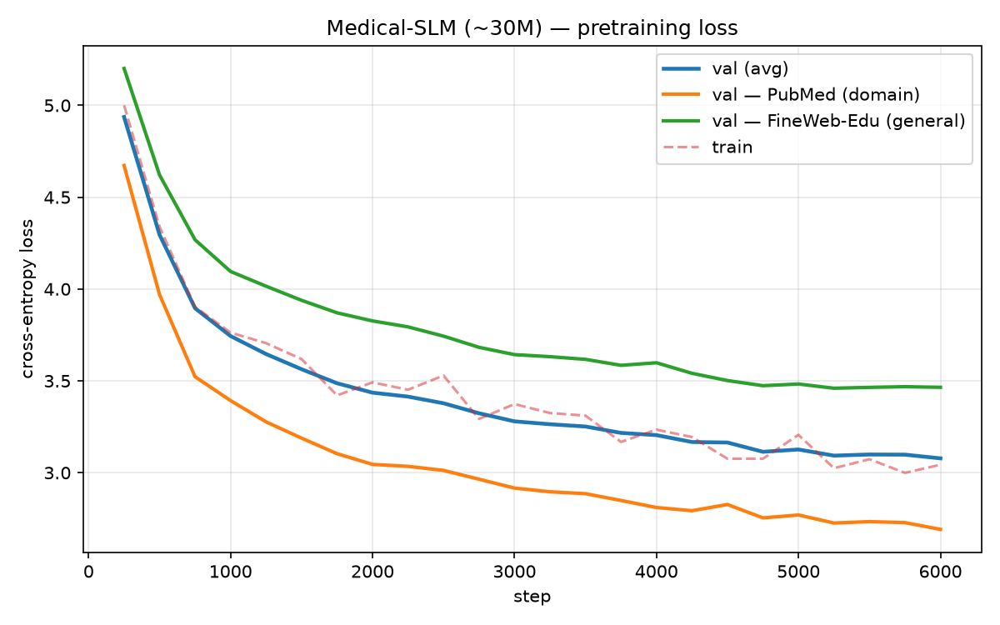

# Medical-SLM — a domain-specific Small Language Model, built **from scratch**

A complete, reproducible pipeline that goes from **raw medical text → a working ~30M-parameter
pharmaceutical language model**, trained entirely from scratch (no borrowed weights) on a **single
6 GB consumer GPU** — for **$0**.

Every stage is hand-written in plain PyTorch: a custom BPE tokenizer, a modern decoder-only
Transformer, a pretraining loop, instruction tuning (SFT), and a zero-shot evaluation harness.

> **One-line result:** the model writes **fluent, correctly-styled pharma prose**, but is
> **at chance on hard multiple-choice exams** (MedMCQA 0.26 vs 0.25 guessing). This is a
> **capacity** limit of a 30M model, not a data/training limit — instruction tuning did **not**
> move the MCQ score, and the model never overfit. See [Results](#results).

---

## What "from scratch" means here

No pre-trained model is fine-tuned. All six stages are built here:

```
Gather data → Train tokenizer → Define model → Pretrain → Instruction-tune (SFT) → Evaluate
```

This is the same recipe behind GPT-style models, shrunk to a size one person can train, explain,
and afford. Going from scratch is also what makes a **custom domain tokenizer** possible on day
one — impossible when fine-tuning someone else's model.

---

## Results

### Zero-shot evaluation (answer-likelihood, n=500)

| Task | Base | + SFT | Chance | Read |
|---|---|---|---|---|
| **MedMCQA** (4-option) | 0.258 | 0.260 | 0.250 | **flat, at chance → capacity-bound** |
| **PubMedQA** (yes/no/maybe) | 0.464 | 0.514 | 0.333 | **above chance; SFT +0.05** |

**What this means.** On a 4-option medical exam the model is right ~26% of the time; guessing is
25%. So on *hard reasoning* questions it's at a coin-toss — and **SFT couldn't fix it**, because
instruction tuning teaches answer *format*, not reasoning *capacity*. That's the proof it's a
**size** limit. On the simpler 3-way PubMedQA task the model *does* carry real signal (0.46 → 0.51
with SFT) — capacity gates *what kind* of task is reachable, not everything.

### Pretraining (single RTX 2060, ~197M tokens, ~0.7 epoch)

| Metric | Start | End |
|---|---|---|
| val-loss (avg) | 4.94 | **3.08** |
| val-loss — PubMed (domain) | 4.67 | **2.69** |
| val-loss — FineWeb-Edu (general) | 5.20 | **3.46** |

`train_loss (3.04) ≈ val_avg (3.08)` — **no overfitting**, so the model is data/capacity-bound, not
memorizing. Domain loss ends *below* general loss because PubMed abstracts are more formulaic than
open web text.



### Sample generations (base model, completion)

> **Prompt:** *"Common side effects of metformin include"*
> *"…hyperprolactinemia and hypoxia. Male subjects received metformin. Thirty and thirty-one adults
> presenting with a history of diabetes mellitus… metformin is effective for the prevention of
> diabetes mellitus."*

Fluent, correct medical *register* and real terminology — but factually shaky, and it invents
plausible-sounding compounds (e.g. *"dipropionulphoxide"*). That fluency-without-reliability is the
whole point: **generating text needs far less reasoning capacity than acing MCQs.**

### Sample generations (after SFT, chat)

> **Q: What are the common side effects of warfarin?**
> *"1. Hypoxia  2. Chronic hypoxia … 8. Overdose or postinfarction … 10. Leukopenia …
> 16. Nausea and vomiting … 18. Low blood counts …"*

After SFT the model **adopts the answer format** — here, a numbered side-effect list — which the
base model never did. But at 30M it can't reliably *populate* it: items repeat (Hypoxia ×4), the
numbering breaks (15, 15, 17, 17), it blends plausible entries (leukopenia, low blood counts,
nausea) with hallucinations (*"Dysbusceptia"*), and it misses *bleeding* — warfarin's defining side
effect. **SFT bought behavior, not knowledge** — the qualitative twin of the flat MedMCQA score.

---

## Architecture

**Model** (`src/transformer.py`, `src/layers.py`) — a modern, compact decoder-only Transformer,
hand-written in plain PyTorch:

| Component | Choice |
|---|---|
| Params | ~30M |
| dim / layers / heads | 512 / 8 / 8 |
| Context length | 512 |
| Vocab | 8,000 (custom BPE) |
| Positional encoding | **RoPE** (rotary) |
| Normalization | **RMSNorm** (pre-norm, fp32) |
| Feed-forward | **SwiGLU** |
| Attention | FlashAttention via `F.scaled_dot_product_attention`; optional **GQA** |
| Tied embeddings | yes |
| Precision | fp16 (Turing) |

**Tokenizer** (`scripts/build_data.py`) — 8k byte-level BPE trained on a general+pharma blend.
Special tokens reserved up front for the chat/SFT format: `<|endoftext|> <|pad|> <|system|>
<|user|> <|assistant|>`. Fertility ~2.75 tok/word on dense pharma text.

**Data loader** (`src/dataset.py`) — each source is a flat `uint16` `.bin` file read via `np.memmap`;
a batch samples which source each sequence comes from by weight, so the general/domain **mix ratio
is a runtime knob** (no re-tokenizing to change it).

**Training** (`src/trainer.py`) — cosine LR with warmup, gradient accumulation, **per-source
validation loss**, checkpointing, and resume-from-`latest.pt`.

**SFT** (`src/sft.py`) — chat template `<|user|>\n{q}<|assistant|>\n{a}<|endoftext|>`, with **loss
masked to the response tokens only**.

**Eval** (`src/evaluate.py`) — zero-shot multiple-choice by **answer-likelihood**: score each option
by the model's length-normalized log-probability, pick the argmax. No task-specific training.

---

## Data

All open, streamed from the HuggingFace Hub. ~298M tokens tokenized (149M each), 50/50 mix.

| Source | Role | ~Tokens |
|---|---|---|
| `HuggingFaceFW/fineweb-edu` (`sample-10BT`) | general English | ~149M |
| `casinca/PUBMED_title_abstracts_2019_baseline` | PubMed abstracts (domain) | ~149M |

**SFT data** (`src/sft_data.py`, 12k examples): 6k `openlifescienceai/medmcqa`, 4k
`qiaojin/PubMedQA` (artificial), 2k `yahma/alpaca-cleaned` (general).

**Held-out eval:** MedMCQA *validation*, PubMedQA *labeled*.

---

## Reproduce it end-to-end

**Prereqs:** Python 3.11, an NVIDIA GPU (works on 6 GB). `pip install -r requirements.txt`.
A free `huggingface-cli login` makes streaming faster/more reliable.

```bash
# 1) Build the 8k tokenizer + tokenize the corpus (CPU, streams from HF, ~20-40 min)
python scripts/build_data.py --vocab-size 8000 --tok-docs 50000 \
    --general-budget 150000000 --domain-budget 150000000

# 2) (optional) 30-second CPU smoke test of the whole loop
python scripts/train.py --config configs/smoke.yaml --out-dir runs/smoke

# 3) Pretrain the ~30M model (single GPU, ~3 h on an RTX 2060)
python scripts/train.py --config configs/local-GPU.yaml --out-dir runs/local30m

# 4) Build the SFT set + instruction-tune
python src/sft_data.py --n-medmcqa 6000 --n-pubmedqa 4000 --n-general 2000
python src/sft.py --base runs/local30m/best.pt --out runs/local30m/best_sft.pt --epochs 3

# 5) Evaluate (base vs SFT)
python src/evaluate.py --ckpt runs/local30m/best.pt     --tasks medmcqa,pubmedqa --limit 500
python src/evaluate.py --ckpt runs/local30m/best_sft.pt --tasks medmcqa,pubmedqa --limit 500

# 6) Chat with it
python src/generate.py --ckpt runs/local30m/best_sft.pt --chat \
    --prompt "What is the mechanism of action of aspirin?"

# 7) Plot the loss curve
python scripts/plot_metrics.py --run runs/local30m --out assets/loss_curve.png
```

---

## Repo layout

```
src/
  config.py        one dataclass config, YAML-loadable
  layers.py        RMSNorm + RoPE
  transformer.py   SwiGLU, GQA attention, the GPT model
  dataset.py       memmap mixing loader (mix ratio = runtime knob)
  trainer.py       Trainer class: cosine LR, grad accum, per-source val, resume
  sft.py           instruction tuning (chat template, response-masked loss)
  sft_data.py      build the 12k-example SFT set
  evaluate.py      zero-shot MCQ by answer-likelihood
  generate.py      inference / sampling (--chat)
scripts/
  build_data.py    train tokenizer + tokenize corpus -> data/*.bin
  train.py         entry point for pretraining
  plot_metrics.py  plot training curves from metrics.jsonl
configs/
  smoke.yaml       tiny end-to-end sanity config
  local-GPU.yaml   the ~30M / 6GB run
  small.yaml       a larger ~60M config (rent a bigger GPU)
```

---

## Methodology & lessons

- **~50% domain, not 99%.** Continued-pretraining medical models use ~99% domain, but they start
  from a base that already speaks English. Training *from scratch*, a 50/50 mix keeps general fluency
  while still crashing the domain loss.
- **Judge on tasks, not loss.** Low val-loss ≠ good answers — the eval is the real test.
- **Capacity is the ceiling.** A well-fit 30M model that never overfits *still* can't clear chance on
  hard MCQ. The fix is scale, not more epochs.
- **Custom tokenizer is free when from-scratch** — and impossible when fine-tuning. Took it.

## Limitations & next steps

- **Capacity-bound on hard MCQ.** For exam-level accuracy, scale to 60M+ params and more tokens —
  change `configs/small.yaml` and rerun. The whole pipeline already supports it.
- Not a medical device; outputs can be wrong. For education/research only.
- **Planned ablations:** learning-rate sweep (3e-4 / 8e-4 / 1e-3); mix-ratio sweep (30/50/70%
  domain); a 30M → 60M scaling run to test whether MedMCQA finally moves off chance.

---
